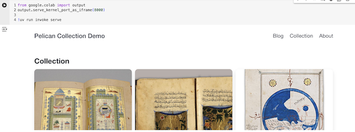

# pelican-via-google-colab
Notebooks for playing with the pelican python site generator, for when installing and configuring things on local computers is more trouble than its worth (eg, in a classroom setting)

For Collection Builder, see [Frederick Elwert's repository here.](https://github.com/frederik-elwert/pelican-collection-demo)

Pelican Quick Start: 

